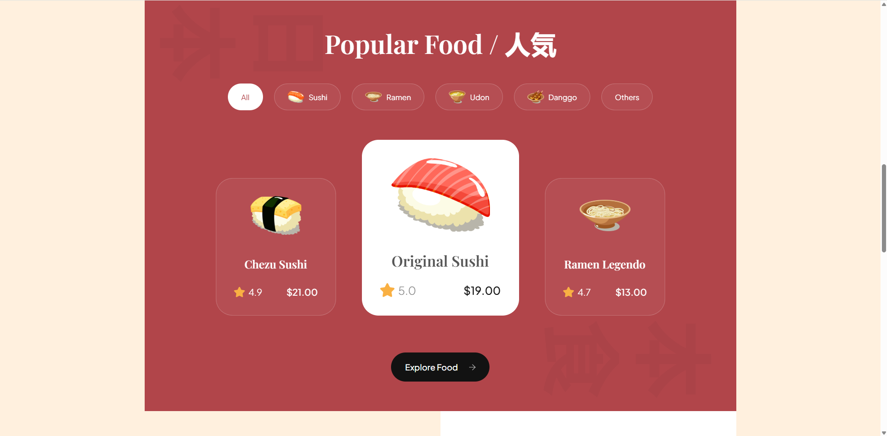
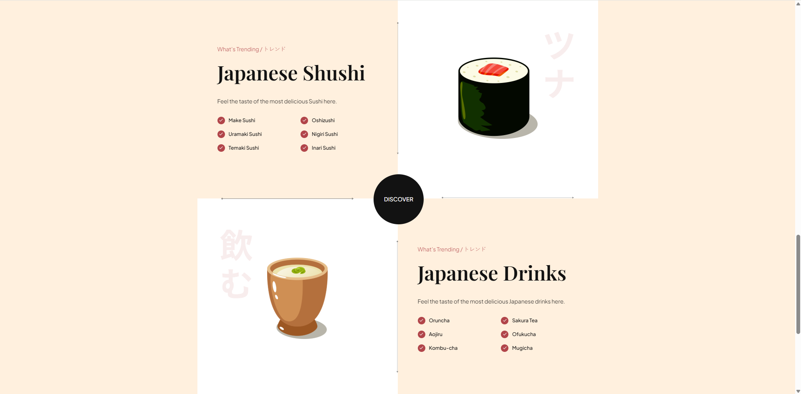
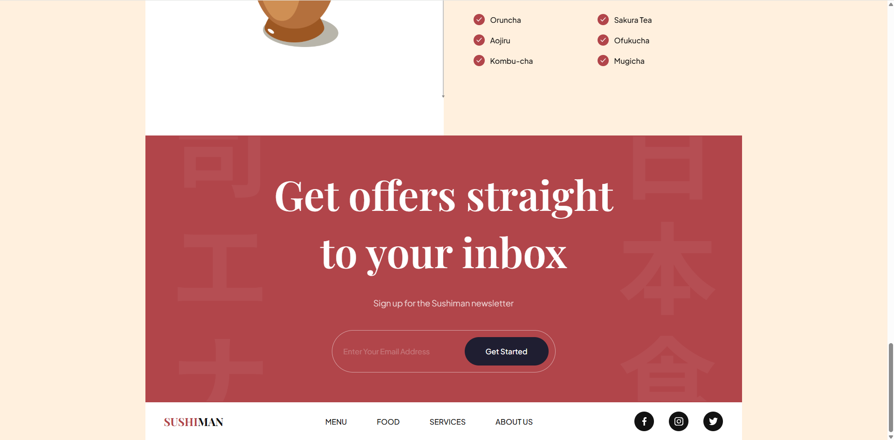
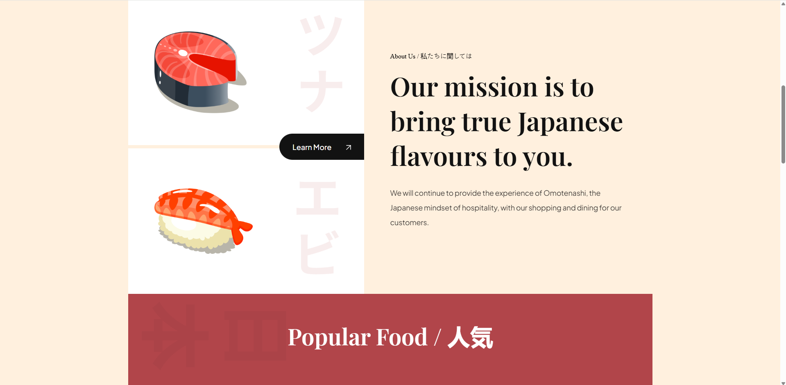

# 🍣 Sushi Website

A visually engaging and responsive **Sushi Restaurant** landing page, built using **HTML**, **CSS**.

## 🙏 Credits
- [JavaScript Mastery](https://www.youtube.com/@javascriptmastery)
---

## 📸 Preview

### 🏠 Homepage


### 🍣 Menu Section


### 🍤 Food Highlights


### 🔧 Services Section


### 📖 About Us Section


---

## 🧑‍💻 Getting Started

### Prerequisites

- Node.js & npm

### Installation

```bash
git clone https://github.com/abdessamadG/html_css_sushi_website.git
cd html_css_sushi_website
npm install
npm run dev

